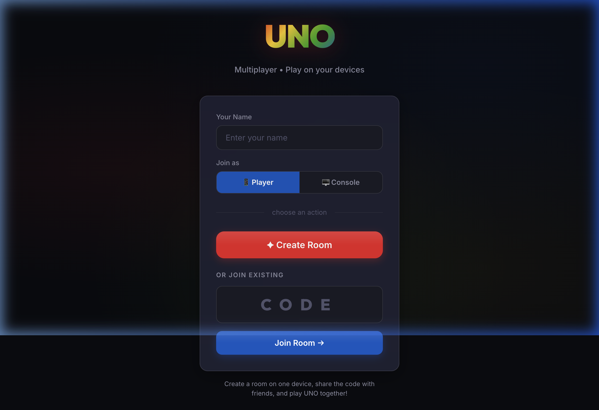

# 🎴 UNO Multiplayer

A real-time multiplayer UNO card game designed for physical gatherings. Each player uses their own mobile device as their hand, while a shared screen (TV/tablet) acts as the game table.

**Zero configuration** — runs entirely self-hosted with Docker. No external services, no API keys.



## ✨ Features

- 🎮 **Full UNO Rules** — All card effects (Skip, Reverse, Draw 2, Wild, Wild Draw 4), stacking, UNO call/catch
- 📱 **Mobile-First** — Touch-optimized player interface with haptic feedback
- 🖥️ **Console Mode** — Dedicated spectator view for a shared TV/tablet screen
- 🌐 **Works Anywhere** — Play on the same WiFi or over the internet
- 🔊 **Sound Effects** — Web Audio API synthesized sounds (no audio files needed)
- 🎨 **Premium Dark UI** — Glassmorphism, gradient UNO branding, smooth animations
- 🐳 **Docker Ready** — Single `docker compose up` to deploy
- 🔒 **Secure by Design** — Session tokens, rate limiting, zero client-side trust

## 🔒 Security

| Measure | Description |
|---------|-------------|
| **Session Tokens** | Cryptographic session tokens (`crypto.randomBytes`) authenticate reconnections — prevents player impersonation |
| **Data Isolation** | Player IDs are never broadcast to clients — only `isYou`/`isHost` flags and array indices are sent |
| **Rate Limiting** | Per-socket rate limiting (20 events/sec) on all Socket.IO handlers prevents abuse |
| **Input Sanitization** | Player names are stripped of HTML tags, backticks, `javascript:` URIs, and inline event handlers |
| **Crypto Shuffle** | Card deck uses `crypto.randomInt()` for cryptographically secure Fisher-Yates shuffle |
| **CORS Policy** | Same-origin only in production; explicit allowlist required in development (no wildcard) |

## 🚀 Quick Start

### Docker (Recommended)

```bash
docker compose up -d --build
```

### Local Development

```bash
npm install
npm start
```

Open `http://localhost:3000` on any device.

## 🎯 How to Play

1. **Create a Room** — Enter your name and tap "Create Room"
2. **Share the Code** — Give the 4-character room code to your friends
3. **Join** — Friends open the same URL, enter the code, and join
4. **Console** — Optionally, join from a TV/tablet as "Console" to display the game table
5. **Play!** — Host taps "Start Game" and everyone gets 7 cards

### Controls

| Action | How |
|--------|-----|
| Play a card | Tap to select → Tap again to play |
| Draw a card | Tap the "Draw" button |
| Call UNO | Tap "UNO!" when you have 2 cards |
| Catch someone | Tap 🚨 when someone forgets to call UNO |
| Wild card | Color picker appears automatically |

## 🏗️ Architecture

```
┌─────────────────────────────────┐
│        Docker Container         │
│                                 │
│  Express ──── Static Files      │
│     │                           │
│  Socket.IO ── Game Engine       │
│     │                           │
└─────┼───────────────────────────┘
      │ WebSocket
      ├──── Player 1 (Phone)
      ├──── Player 2 (Phone)
      ├──── Player 3 (Phone)
      └──── Console (TV/Tablet)
```

- **Server-side game engine** — All game logic runs on the server (authoritative)
- **Socket.IO** — Real-time bidirectional communication
- **Express** — Serves static files and card assets
- **No database** — Game state is in-memory (rooms are ephemeral)

## 📁 Project Structure

```
├── server.js              # Express + Socket.IO server
├── Dockerfile             # Node.js Alpine container
├── docker-compose.yml     # Deployment config
├── package.json
├── uno-cards/             # 54 card image assets
└── public/
    ├── index.html         # Landing page
    ├── player.html        # Player view (mobile)
    ├── console.html       # Console view (TV)
    ├── css/style.css      # Design system
    └── js/
        ├── app.js         # Landing page logic
        ├── player.js      # Player client
        ├── console.js     # Console client
        ├── game-engine.js # UNO rules engine
        └── sounds.js      # Audio effects
```

## 🃏 UNO Rules Implemented

| Rule | Details |
|------|---------|
| Card matching | Color, number, or symbol match |
| Wild | Play anytime, choose next color |
| Wild Draw 4 | Next player draws 4 + choose color |
| Draw 2 | Next player draws 2 (stackable!) |
| Skip | Next player loses their turn |
| Reverse | Reverses play direction (2-player = skip) |
| Drawing | Draw 1 if you can't play; option to play it if valid |
| UNO Call | Must call UNO at 1 card; +2 penalty if caught |
| Deck Reshuffle | Automatically reshuffles discard pile when deck empties |

## 🛠️ Tech Stack

- **Runtime**: Node.js 20
- **Server**: Express 4
- **Real-time**: Socket.IO 4
- **Audio**: Web Audio API (oscillator-based)
- **Deployment**: Docker / Docker Compose
- **Styling**: Vanilla CSS (dark theme, glassmorphism)

## 📄 License

MIT
